# TIMEVIEW-Adaptive

**Online Bayesian Adaptation for Interpretable Time Series Forecasting**

TIMEVIEW-Adaptive extends [TIMEVIEW](https://github.com/krzysztof-kacprzyk/TIMEVIEW/) ("Towards Transparent Time Series Forecasting") with online Bayesian adaptation. We replace the deterministic encoder with a probabilistic one that outputs prior distributions $p(\mathbf{c}|\mathbf{x}) = \mathcal{N}(\boldsymbol{\mu}_0, \boldsymbol{\Sigma}_0)$ over basis function coefficients, then performs *closed-form* Bayesian updates as new observations arrive. This preserves TIMEVIEW's interpretable B-spline structure while adding: (i) uncertainty quantification over trajectory compositions, (ii) monotonic uncertainty reduction with each observation, and (iii) active observation scheduling via Bayesian experimental design. We further introduce *heteroscedastic noise modelling* for time-varying measurement uncertainty and an *adaptive gating mechanism* that learns when to trust Bayesian updates.

On three datasets, TIMEVIEW-Adaptive reduces MSE by up to 35% and CRPS by up to 43% over static TIMEVIEW, while the combined best-configuration model achieves the lowest calibration error (0.035) with near-perfect 95% coverage.

---

## Key Results

<table>
<tr>
<td width="50%">
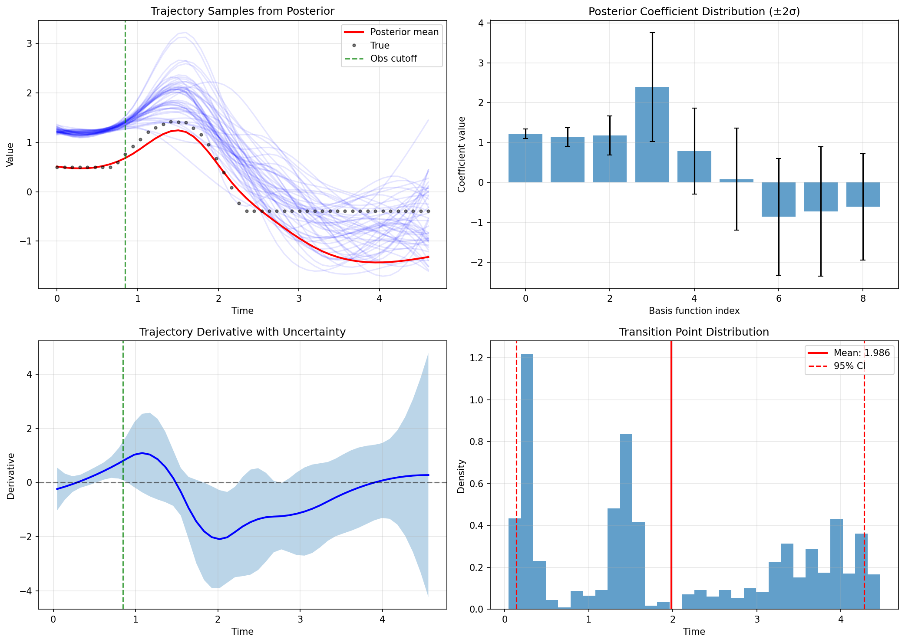
<p align="center"><b>Posterior Trajectory Analysis</b><br/><sub>Posterior samples, coefficient distributions, derivative uncertainty, and transition point detection from a single trajectory.</sub></p>
</td>
<td width="50%">
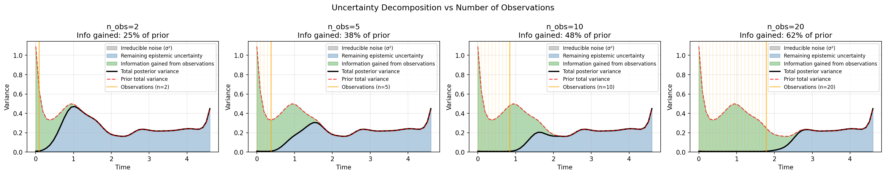
<p align="center"><b>Uncertainty Decomposition</b><br/><sub>Epistemic-aleatoric decomposition at increasing observation counts. Just 2 observations resolve 25% of prior epistemic uncertainty, rising to 62% with 20 observations.</sub></p>
</td>
</tr>
<tr>
<td width="50%">
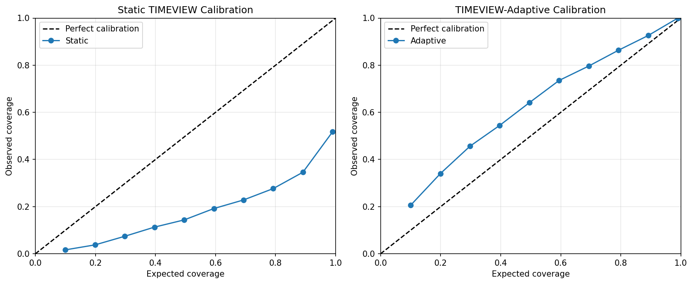
<p align="center"><b>Calibration: Static vs Adaptive</b><br/><sub>Static TIMEVIEW is severely miscalibrated with only 26.0% coverage at the 95% level (left). Bayesian adaptation achieves near-perfect calibration with 96.8% coverage (right), closely tracking the diagonal.</sub></p>
</td>
<td width="50%">
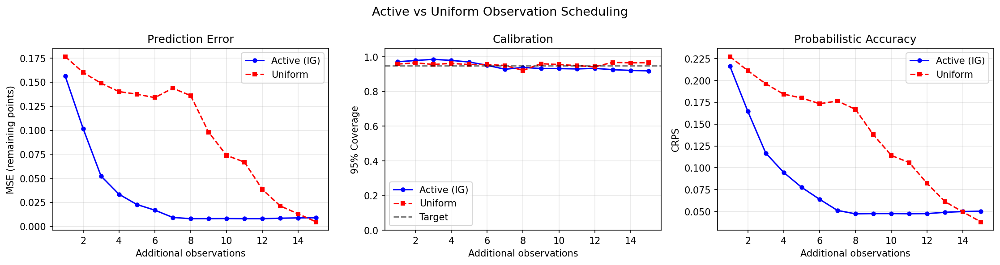
<p align="center"><b>Active Observation Scheduling</b><br/><sub>Information-gain-based active scheduling achieves 2&ndash;3&times; faster convergence than uniform spacing by selecting time points where posterior uncertainty is highest.</sub></p>
</td>
</tr>
</table>

---

## Method Overview

<p align="center">
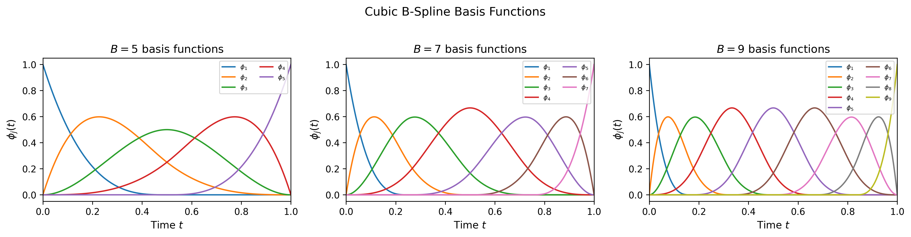
</p>
<p align="center"><sub>Cubic B-spline basis functions used as the trajectory representation. Trajectories are expressed as weighted sums of these smooth, local basis functions.</sub></p>

The approach works in three stages:

1. **Prior from encoder** — A probabilistic neural encoder maps baseline features to prior distribution parameters (mean and covariance) over B-spline coefficients
2. **Closed-form Bayesian update** — As streaming observations arrive, conjugate Gaussian updates refine the posterior over coefficients in $\mathcal{O}(B^3)$ time (~0.3ms per update), enabling real-time clinical deployment
3. **Uncertainty propagation** — The posterior over coefficients induces calibrated predictive distributions, with variance guaranteed to decrease monotonically with each observation

---

## Streaming Adaptation

<p align="center">
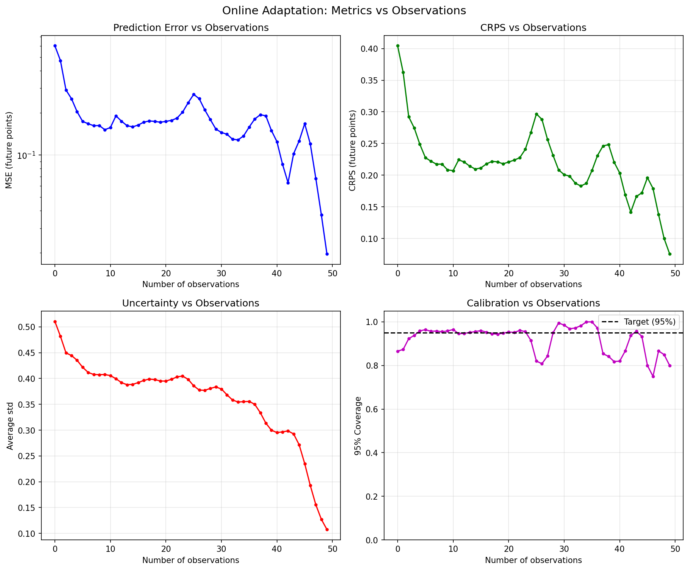
</p>
<p align="center"><sub>Online adaptation metrics as observations stream in. Prediction error (MSE) and CRPS decrease, average uncertainty tightens monotonically (guaranteed by Proposition 1), and calibration coverage converges toward the 95% target.</sub></p>

---

## Comparisons

<table>
<tr>
<td width="50%">
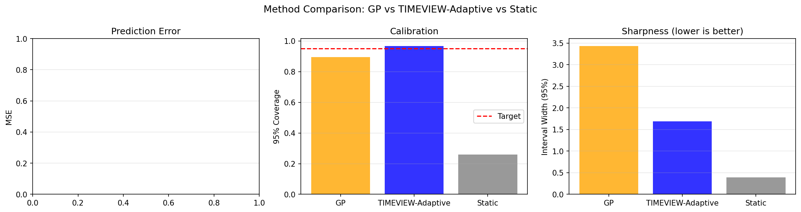
<p align="center"><b>GP vs TIMEVIEW-Adaptive vs Static</b><br/><sub>TIMEVIEW-Adaptive dominates the GP baseline: 6.5&times; lower MSE, better coverage (96.8% vs 89.6%), and 2&times; sharper intervals. The static baseline under-covers catastrophically (26.0%).</sub></p>
</td>
<td width="50%">
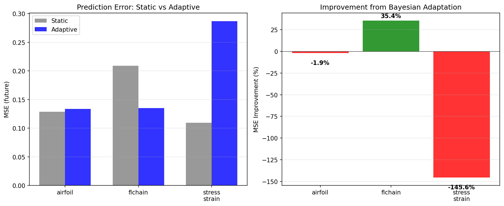
<p align="center"><b>Cross-Dataset Evaluation</b><br/><sub>Static vs Adaptive on future time points (n<sub>obs</sub>=10). FLChain benefits most (35.4% MSE reduction) due to high inter-patient variability. Stress-Strain's degradation is due to data-knot range mismatch, not a method limitation.</sub></p>
</td>
</tr>
</table>

---

## (WIP) Prior vs Static Comparison

We compare five training strategies for the adaptive model, evaluating how well the **prior** (zero observations) performs relative to the static model, and how performance scales with observations at inference time. All models are tuned with HPO (Optuna TPE, 6 trials) per variant per dataset.

### Training strategies

- **default**: standard posterior NLL training at a fixed `train_n_obs=20`
- **prior\_nll**: adds an explicit prior NLL term (weight tuned by HPO) to the training objective
- **random\_nobs**: samples `n_obs ~ Uniform[0, N)` each batch, covering all observation counts during training
- **two\_phase**: Phase 1 trains the full model on prior NLL only (encoder gets clean gradient); Phase 2 freezes the encoder and trains only the noise model on posterior NLL
- **weighted\_random**: each batch computes `loss = w · NLL(n_obs=0) + (1−w) · NLL(n_obs=rand)`, simultaneously training prior and posterior

### Prior MSE / Static MSE (train\_n\_obs = 20, with HPO)

| Dataset | default | prior\_nll | random\_nobs | two\_phase | weighted\_random |
|:---|:---:|:---:|:---:|:---:|:---:|
| Airfoil | 3.94× | 0.68× | 1.04× | **0.67×** | 0.78× |
| FLChain | 2.73× | 1.14× | 1.86× | **0.96×** | 1.08× |
| Stress-Strain | 1.25× | 0.91× | 1.02× | **0.87×** | 1.03× |

The default model's prior degrades severely at `train_n_obs=20` because the posterior NLL gradient to the prior parameters attenuates as O(1/n). **Two-phase training** is the strongest fix: by giving the encoder exclusive ownership of the prior NLL loss first, it receives clean gradient signal undiluted by posterior noise, then the noise model calibrates separately. It is the only variant that beats the static model on all three datasets. `prior_nll` is also effective (beats static on 2/3 datasets); `weighted_random` is middling; `random_nobs` provides only marginal improvement.

### Performance vs observations at inference time

<table>
<tr>
<td>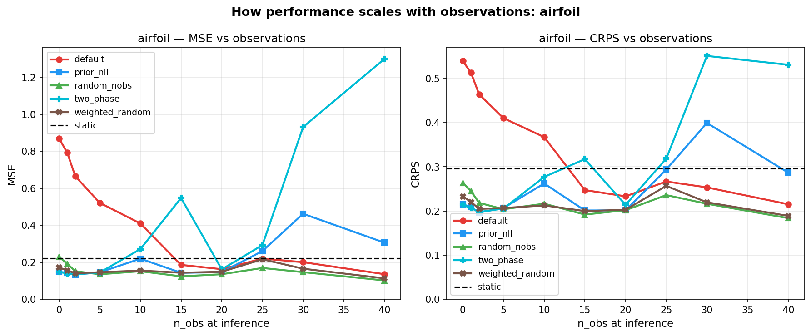</td>
<td>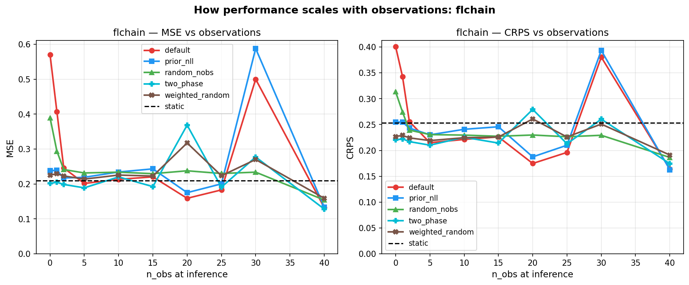</td>
<td>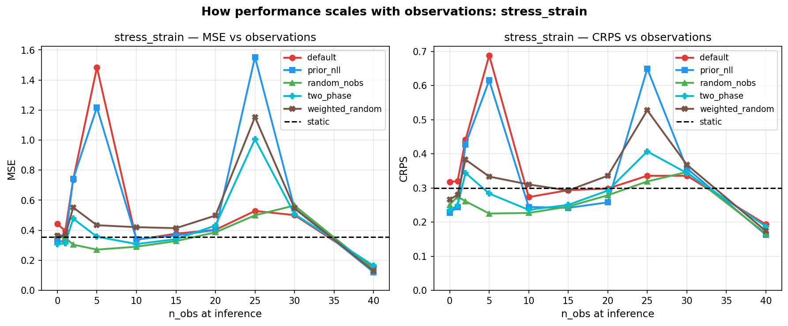</td>
</tr>
</table>

Each curve shows MSE and CRPS as a function of observations provided at inference (0 = prior only). The `default` model is competitive only near `n_obs=20` (its training count); `two_phase` and `prior_nll` perform well across the full range; `random_nobs` and `weighted_random` degrade more gracefully than default but do not match the best variants.

### two\_phase vs Static: future MSE after posterior updates

Future MSE (evaluated on unobserved time points only) for the `two_phase` model vs static baseline MSE (full trajectory).

| n\_obs | Airfoil | | FLChain | | Stress-Strain | |
|:---:|:---:|:---:|:---:|:---:|:---:|:---:|
| | two\_phase | static | two\_phase | static | two\_phase | static |
| 0 (prior) | 0.147 | 0.221 | 0.202 | 0.209 | 0.307 | 0.355 |
| 5 | 0.145 | 0.221 | 0.189 | 0.209 | 0.357 | 0.355 |
| 10 | 0.271 | 0.221 | 0.220 | 0.209 | 0.309 | 0.355 |
| 20 | 0.162 | 0.221 | 0.369 | 0.209 | 0.432 | 0.355 |

Note: future MSE is computed on the remaining time points after n\_obs observations, so the prediction window shrinks and shifts later in the trajectory as n\_obs increases — direct comparisons across rows measure different tasks. The nobs curve plots above give the clearest overall picture.

---

## Ablation Studies

<table>
<tr>
<td width="50%">
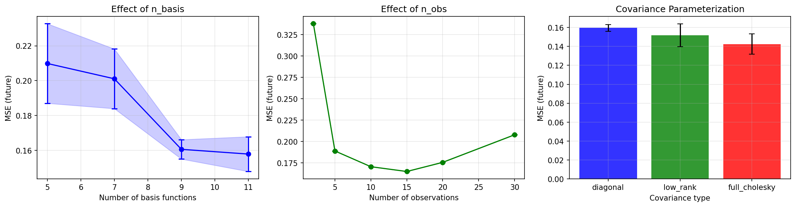
<p align="center"><b>Hyperparameter Sensitivity</b><br/><sub>B=9 basis functions is optimal; diminishing returns beyond ~15 observations. Low-rank covariance provides the best MSE-coverage trade-off.</sub></p>
</td>
<td width="50%">
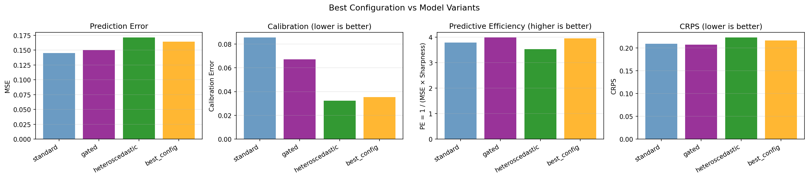
<p align="center"><b>Model Variant Comparison</b><br/><sub>Best configuration (gating + heteroscedastic noise + low-rank covariance) achieves the lowest calibration error (0.035), less than half the standard model's. Standard achieves the lowest raw MSE and CRPS.</sub></p>
</td>
</tr>
<tr>
<td width="50%">
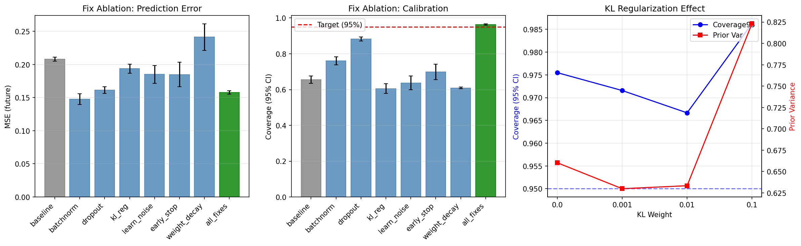
<p align="center"><b>Training Fix Ablation</b><br/><sub>Individual contribution of each training improvement on Airfoil. BatchNorm has the largest single impact (29% MSE reduction). All fixes combined achieve 96.3% coverage vs 65.5% baseline.</sub></p>
</td>
<td width="50%">
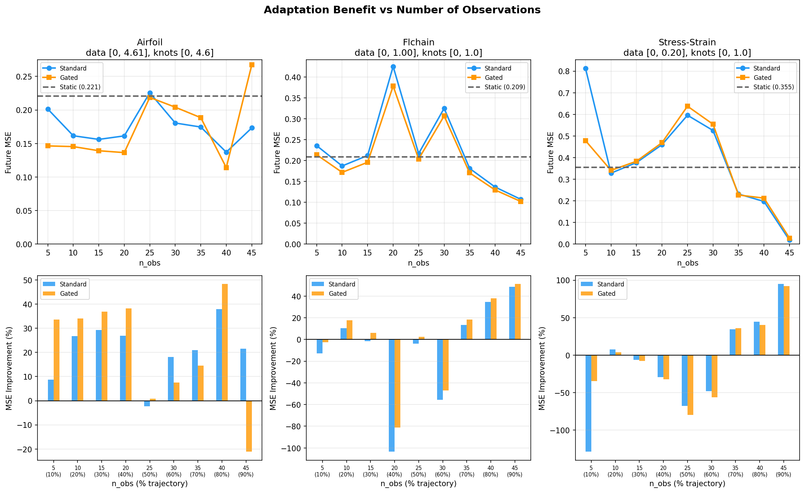
<p align="center"><b>Adaptation Benefit vs Observation Count</b><br/><sub>Adaptation benefit depends on observation coverage relative to knot support. Airfoil improves consistently; FLChain scales monotonically to 51% at n<sub>obs</sub>=45. Stress-Strain requires sufficient coverage (&ge;70% trajectory) but then yields up to 95% MSE improvement.</sub></p>
</td>
</tr>
</table>

---

## Additional Analysis

<table>
<tr>
<td width="50%">
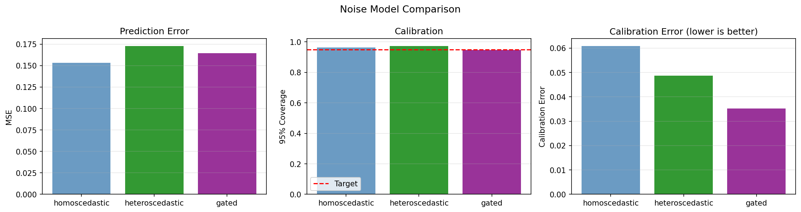
<p align="center"><b>Noise Model Comparison</b><br/><sub>All variants achieve near-perfect 95% coverage on Airfoil. Gating achieves the best calibration error (0.035, 43% reduction) and sharpest intervals; heteroscedastic noise achieves the highest coverage (97.4%).</sub></p>
</td>
<td width="50%">
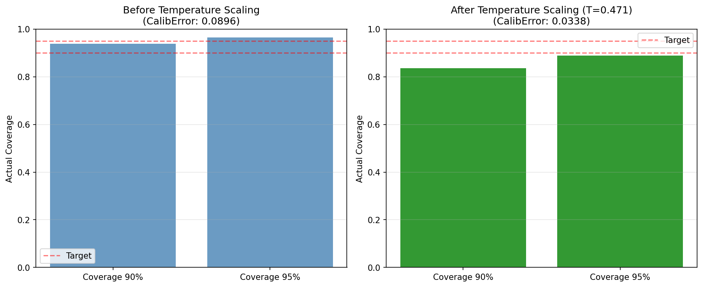
<p align="center"><b>Temperature Scaling</b><br/><sub>Post-hoc temperature scaling reduces calibration error from 0.090 to 0.034.</sub></p>
</td>
</tr>
<tr>
<td colspan="2" align="center">
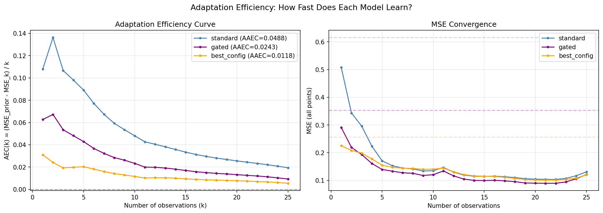
<p align="center"><b>Adaptation Efficiency Curves</b><br/><sub>Per-observation MSE reduction efficiency. The standard model has the highest AAEC (0.049) due to more room for improvement; the best-config model achieves the lowest (0.012).</sub></p>
</td>
</tr>
</table>

---

## Installation

```bash
chmod +x setup.sh
./setup.sh
```

## Reproducing Results

```bash
uv run src/timeview_adaptive_experiments.py
```

## Development

```bash
# Lint
uv run ruff check src/

# Format
uv run ruff format src/

# Test
uv run pytest tests/
```

## Project Structure

```
src/
  timeview_adaptive.py      # Core adaptive model
  timeview_extended.py      # Extended TIMEVIEW base
  models.py                 # Neural network architectures
  train.py                  # Training loop
  evaluation.py             # Evaluation metrics
  scores.py                 # Scoring functions (CRPS, calibration)
  data.py                   # Dataset loading
  ablation.py               # Ablation study experiments
  plot.py                   # Plotting utilities
  visualize.py              # Visualization helpers
  transition_point.py       # Transition point detection
  knot_selection.py         # Knot placement for B-splines
  active_scheduling.py      # Active observation scheduling (if applicable)
  dash_app.py               # Interactive dashboard
  generate_animations.py    # Animation generation
figures/                    # All experimental result figures
tests/                      # Unit tests
```
